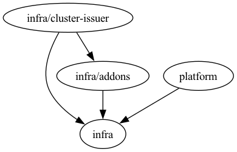

# Azure Kubernetes Service

This contains all resources required to set up AKS for the starterkit.

## State Backend

Existing GCS bucket `meshcloud-tf-states`, prefix `path/to/<module>`. Configured in [tfstate.hcl](tfstate.hcl).

## Apply

Load credentials with `source setup-env.sh` from repo root, then apply:

```bash
terragrunt run --all apply
```

Terragrunt resolves the dependency order automatically. To target a single module: `cd <module> && terragrunt apply`, e.g. `cd kubernetes && terragrunt apply`.
Use the graph in section [Module Dependencies](#module-dependencies) to know which modules need to be applied first.

## Terragrunt Dependencies

Note that the azure subscription used here was manually created, as it's the only subscription used in this entra ID tenant. Therefore no "tenant" or "meshstack" dependency is present here. Ideally, we would have an Azure platform and a dedicated project + tenant in meshStack for this.



Helps in knowing order of execution (arrow = depends on).
Generate the graph with: `terragrunt dag graph | dot -Tpng > dep.png`

## Access Kubernetes cluster

To access the cluster, use the `az` CLI tool. Run:

```bash
az login --tenant 126d3c12-f458-42c3-9f94-cf29cc01dd77

az aks get-credentials --resource-group starterkit --name aks-starterkit --subscription 1567cc6d-6c8f-4dac-a64f-8f7293116490 -f /tmp/aks-kubeconfig --overwrite-existing
```
